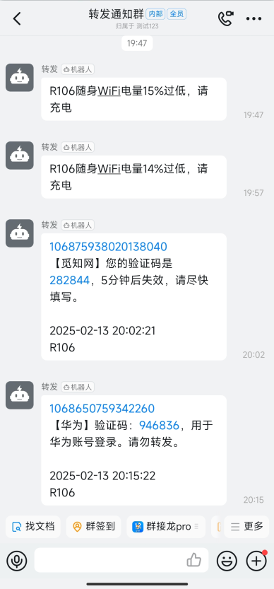
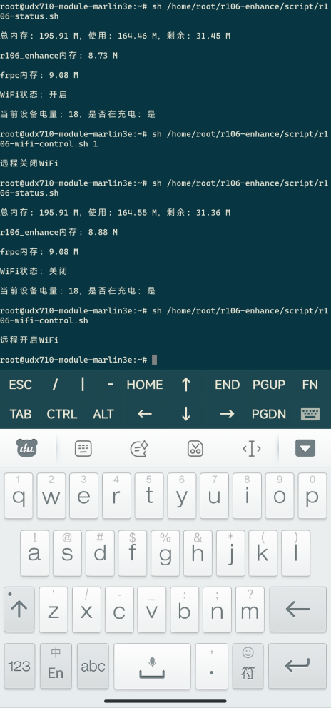
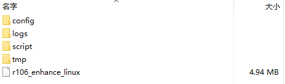
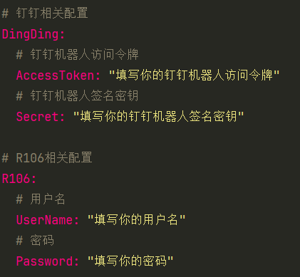

    <h1>R106随身WiFi功能增强</h1>
    
    
    
    

## 功能

- [x] 短信实时转发钉钉通知
- [x] 设备低电量通知提醒
- [x] 搭配frp可通过手机远程控制WiFi
- [x] 远程查看设备当前状态（内存使用情况、WiFi状态、设备电量、充电状态）

## 效果

### 钉钉通知

### 远程查看与控制

### 程序大小

## 使用

1. 下载修改`config.yaml`配置文件

   

2. 开机自启：在`/etc/init.d/hostname.sh`里添加启动`./script/r106-init.sh`脚本的命令 例如：`sh /home/root/r106-enhance/script/r106-init.sh &`

3. 重启设备即可。如果不想重启也可以直接执行`./script/r106-init.sh`脚本

## `下载`

- [蓝奏云下载](https://c-xzhi.lanzouu.com/b0mbd0wze) 密码：Xzhi

- [GitHub下载](https://github.com/GitHub-Xzhi/go-r106-enhance/releases) 

## 💖支持

 **如果这个程序对您有帮助🤓，请给个Star，也可以请作者吃辣条或喝咖啡😋**

| **微信** | **微信赞赏** | **支付宝** |
| :---: | :---: | :---: |
| ||  |

